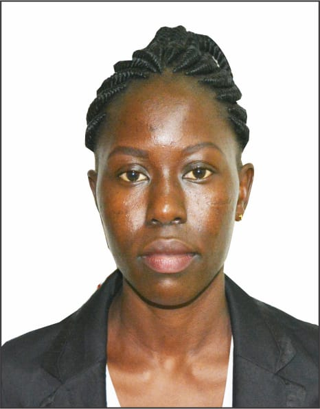
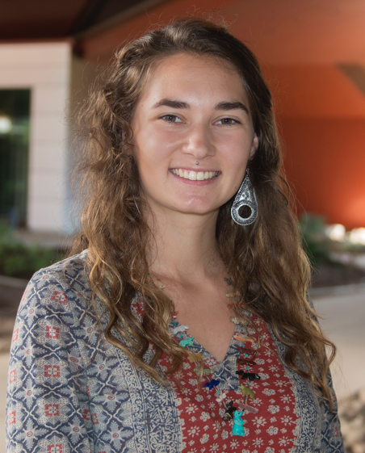

<link rel="stylesheet" href="/assets/css/main.css">
<link rel="stylesheet" href="https://cdn.jsdelivr.net/npm/@fortawesome/fontawesome-free@5/css/all.min.css">
<!--
| A | B |
| C | D |-->

<!-- could have images if we can, not necessary.  later. -->
<!-- || temp|-->
<!-- <i class="fas fa-fw fa-envelope-square" aria-hidden="true"> -->

The following speakers are confirmed for CVPPA 2021.

## Ribana Roscher

**Deep Generative Models for Smart Agriculture**

Deep generative models are neural networks that are capable of learning complex data distributions and have therefore achieved tremendous success in recent years. In general, they can be used for a variety of applications, such as anomaly detection, current state estimation, or forecasting. In this talk, several deep generative models will be presented and how they can be used in agriculture. A particular focus will be on the interpretability of the results, i.e., a human-understandable representation of the results with high information content. One prominent example covered in this talk is an image-based plant growth model utilizing generative adversarial networks to generate the future appearance of plants.

 Ribana Roscher received the Dipl.-Ing. and Ph.D. degrees in Geodesy from the University of Bonn, Germany, in 2008 and 2012, respectively. She is currently an Assistant Professor of Remote Sensing at the Institute of Geodesy and Geoinformation at the University of Bonn and a Visiting Professor in the Future Lab 'AI for Earth Observation' at the Technical University Munich. Her research includes pattern recognition and machine learning specifically for agricultural and environmental science applications.

## Peter McCloskey, Winnie Onyango, and Annalyse Kehs

**PlantVillage *Nuru*: An offline AI assistant for disease diagnostics in food crops**

Pests and diseases in staple food crops are a chronic challenge for farmers and they can reduce their yields up to 100%. In countries where there is a lack of extension and human expertise, we see significant yield gaps between national and global yield rates and significantly higher food insecurity levels. This lack of extension and support for farmers is a critical problem when climate change consequences are included in the equation because it is amplifying the already existing chronic challenges for farmers. Temperature and rainfall patterns are increasingly variable which makes the upcoming seasons difficult to plan for when you don’t have access to the weather forecast, let alone an extension agent with knowledge to educate you on the health of your field. To overcome to these challenges, we developed an offline AI assistant called *Nuru* (Swahili for light) capable of diagnosing pest damage and diseases for staple food crops, quickly and accurately, in real-time, on a low-end smartphone device.

The backbone of *Nuru* is a TensorFlow object detection model that runs inference in the phone using TFLite. We work with disease experts from CGIAR to collect the data to train the model, determine the algorithm that is used to give a diagnosis based on the recognized foliar symptoms and the advice for best management practices upon receiving a diagnosis. Our ground team, known as the Dream Team, provides technical support and additional education to the farmers to ensure they receive the maximum benefit from the assistant. The Dream Team also provides feedback on the model performance over time and can identify when there are new symptoms that the model is failing to correctly recognize, then collect images of these symptoms so they can be added to the model. Through this blended model of human (Dream Team) and AI (*Nuru*) assistance, we can effectively help farmers determine what pests and diseases are affecting their crop and provide advice on how to best manage it.

 Pete McCloskey is the Lead A.I. Engineer for PlantVillage. He has been with PlantVillage since 2016. He specializes in developing offline, on-device machine learning models using TensorFlow for plant disease and pest damage recognition. He is currently developing models to recognize diseases and pest damage in cassava, maize, sweet potato, Irish potato, wheat,  as well as identify the life cycle stage of locusts using computer vision.

 I am Winnie Atieno Onyango, Associate Country Director and Field Research Extension officer at PlantVillage. I hold a Bachelor degree in Agricultural Extension and Education from Moi University Eldoret Kenya. Currently I am involved in helping smallholder farmers adapt to climate change through democratization and dissemination of knowledge and technology, optimized locally and scaled globally. The current active research projects in Kenya being integration of human intelligence (Youths) in application of artificial intelligence (AI) in diagnosis of diseases and pests on cassava, maize and other crops, vaccination of FAW using parasitoids and bio pesticides, agroforestry, push-pull technology and adaptation to climate change.

 Annalyse Kehs is the Operations Director of PlantVillage, a global platform that uses AI, satellites and cloud computing to help smallholder farmers adapt to climate change. She previously held the role of engineer at PlantVillage (since January 2017). She worked on projects ranging from machine learning modeling on satellite imagery of fields to building a 12-person team in Kenya.  In addition to working directly with farming communities in Kenya and India she has engaged leadership at the United Nations Food and Agriculture Organization in Rome on the powerful role technology can play in transforming the lives of low-income farmers struggling to cope with climate change.

