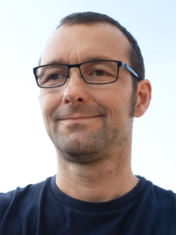

<link rel="stylesheet" href="/assets/css/main.css">
<link rel="stylesheet" href="https://cdn.jsdelivr.net/npm/@fortawesome/fontawesome-free@5/css/all.min.css">
<!--
| A | B |
| C | D |-->

<!-- could have images if we can, not necessary.  later. -->
<!-- || temp|-->
<!-- <i class="fas fa-fw fa-envelope-square" aria-hidden="true"> -->

The following speakers are confirmed for CVPPA 2023.

## Andreas Hund, Crop Science, ETH Zurich

**Carrying cameras through a wheat field: a game-changer for crop improvement?**

Field phenotyping of wheat research trials will significantly increase our understanding of genotype-environment interactions (G x E), i.e. the differential reaction of genotypes to the environment. Particularly, image-based high-throughput phenotyping allows to dissect yield including its G x E effects into smaller components. A basic requirement is to assess phenology, i.e., the timing at which a certain developmental stage is reached (e.g., emergence, joining, heading, and physiological maturity). This requires a continuous monitoring of the crop. Moreover, quantities at defined phenological stages (e.g., canopy cover at jointing or canopy height after heading) can be used as important covariates for yield. Measuring stress response, for example as a change in organ size after a stress event, holds great promise as explaining variable for G x E. Examples include the reduction of leaf area after frost (freezing damage) or during hot and dry days (leaf rolling). Moreover, within organs (i.e. leaves, spikes, and stems), the changes in color due to senescence, nutrient deficiency, or pathogen damage may be monitored.

However, a robust segmentation and quantification of organs under field conditions will require large amounts of well-annotated images for training and validation. Also, sensing and robotic solutions will require more investment, before they may deliver timely decision support for breeders. Most systems including the related analysis workflows are still too complex to handle. I will outline the current state-of-the art in proximal, image-based field phenotyping using the example of wheat. This will include activities in the field phenotyping platform (kp.ethz.ch/FIP) as well as the EMPHASIS (https://emphasis.plant-phenotyping.eu/) and global wheat network (http://www.global-wheat.com/).

 Andreas Hund is a Professur für Kulturpflanzenwiss in the Department of Environmental Systems Science at ETH Zürich. His research focus is the adaptation of crop varieties to low nitrogen input conditions and abiotic stress. He started his career with genome mapping of root development of maize. He recently changed the focus on crop development under field conditions. His team continuously phenotypes wheat throughout its development using the Field Phenotyping Platform (FIP) and the Phenofly infrastructure.
